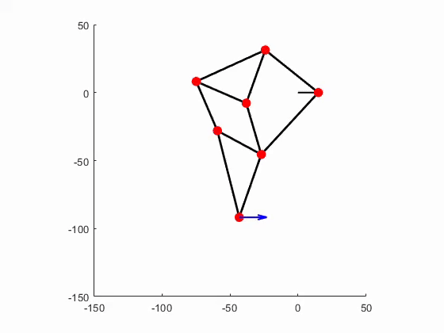

# appliedmath_assignment02

The modeling and simulation of such linkages can be done through root-finding methods, which we have developed so far throughout this course. In this project specifically, we were able to simulate a linkage from a *Strandbeest*, which are wind-powered walking sculptures created by the artist Theo Jansens. Each leg of a *Strandbeest* consists of a linkage system that is driven by a rotating crank, designed specifically to generate a natural walking motion.

Below is an animation visualizing the simulation:

